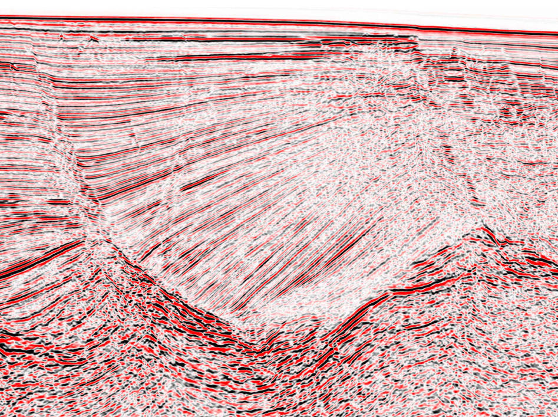

# Data-Collection-using-Web-Scraping

Datasets are essential for all scientists to conduct research, especially coders geoscientists. Research is an inquiry-based process that includes recognising a question, gathering data, analysing and evaluating results, drawing conclusions, and sharing the knowledge gained. The ability to conduct research mainly depends on the datasets. There are massive open-source data available online. However, it is often challenging for students and researchers to navigate the datasets, collect the data and download it. Because mainly data discoverability is poor, documentation is sometimes lacking, and licences can be confusing. I hope with these two projects to add toward the solution of these problems.

I this sense, I have conducted two web scraping projects:

1.	USGS web scraping:  

In this project, I have explored all the seismic data surveys available on the USGS website (https://www.usgs.gov/science-explorer-results?es=3D+Seismic+data&classification=data) and contributed by providing 600 seismic surveys in SEGY format, ready to download with all the necessary navigation metadata.

2.	VSA web scraping:  

I have also web scraped the Virtual Seismic Atlas (VSA) https://www.seismicatlas.org/ to build a seismic images dataset used in machine learning analysis using a convolution neural network (CNN) to distinguish by faults and folds and discriminate between salt, sedimentary layers, noise and basement.  

For more information about the machine learning work, please see our abstract @ https://meetingorganizer.copernicus.org/EGU21/EGU21-6385.html and paper. 

Results:

The 600 seismic surveys will be available in the excel attached file, and the seismic images dataset will be attached to our machine learning project.
